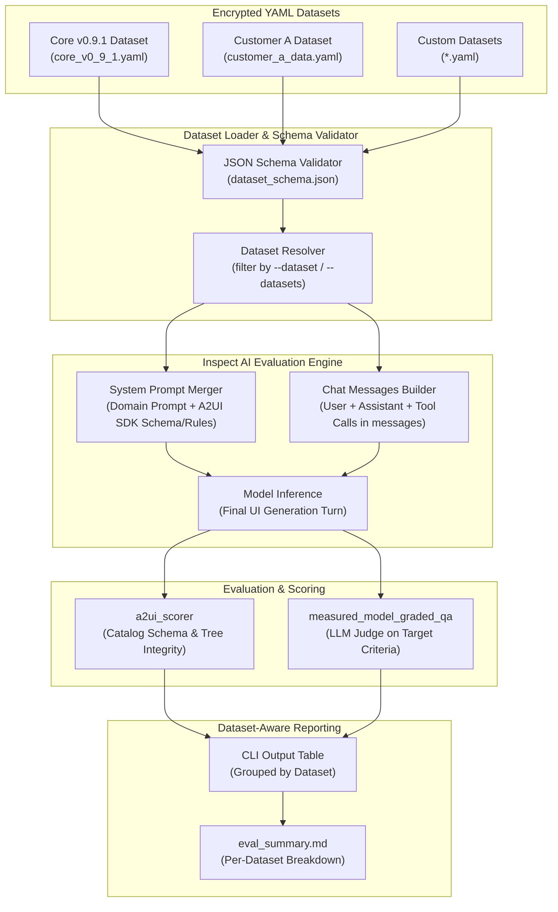

# Evaluation dataset expansion and agentic data points design

_Status: Draft_

_Author: A2UI Team_

_Created: 2026-07-23_

## Background

The A2UI evaluation framework located in [eval/](../../eval) tests whether Large Language Models generate valid and contextually appropriate A2UI JSON payloads. The current framework runs Inspect AI tasks ([eval/tasks.py](../../eval/tasks.py)) against prompt datasets stored in YAML format. Datasets are encrypted at rest using Transcrypt to prevent data contamination from web crawlers.

While the existing system tests basic generation well, real-world agentic applications present scenarios that the current setup cannot evaluate:

1. **Monolithic dataset files**: All evaluation samples reside in monolithic YAML files. There is no mechanism to isolate data points into separate modular datasets (such as `core_v0_9_1`, `customer_a_data`, or `banking_app`), execute only a specific dataset, or view separate reporting tables per dataset.
2. **Disconnected single-string prompts**: The existing schema ([eval/datasets/dataset_schema.json](../../eval/datasets/dataset_schema.json)) uses a standalone `promptText` string. Real agentic applications pass a structured `messages` list containing prior user queries, assistant responses, and tool calls with execution outputs before the model generates UI.
3. **Domain system prompts and custom catalogs**: In production applications, models receive domain-specific system prompts (such as customer support rules, flight booking domain logic, or medical guidelines) that are separate from A2UI protocol instructions. Applications also define custom component catalogs with specialized UI elements. The current eval engine only injects A2UI protocol instructions without merging custom domain system prompts or supporting multi-turn chat history.
4. **Contributor onboarding**: Contributors and external teams creating new data points need a clear, step-by-step workflow covering decryption, schema verification, local evaluation execution, and safe encrypted commits.

This proposal outlines the technical design for expanding the evaluation framework to support separate modular datasets, standard LLM chat completion message formats (`messages`), custom catalogs with merged domain system prompts, and a contributor guide. All existing data points are cleanly migrated into modular dataset files under `eval/datasets/`, eliminating legacy monolithic files and obsolete field aliases.

---

## Architecture overview

The expanded evaluation pipeline adds dataset discovery, standard LLM `messages` array parsing, system prompt merging, and dataset-aware reporting to Inspect AI.



---

## 1. Separate datasets of data points

### Directory organization

Dataset files will be organized under [eval/datasets/](../../eval/datasets) as separate modular YAML files. The legacy monolithic files (`prompts_v0_9_1.yaml` and `prompts_v1_0.yaml`) are migrated directly into named dataset files:

```
eval/datasets/
├── .gitattributes                  # Transcrypt filter rules
├── dataset_schema.json             # Updated JSON schema for data points
├── defaults.py                     # Default prompt templates and catalog paths
├── core_v0_9_1.yaml                # Migrated core dataset for v0.9.1 protocol
├── core_v1_0.yaml                  # Migrated core dataset for v1.0 protocol
├── customer_a_data.yaml            # Customer A specific agentic scenarios
└── flight_booking.yaml             # Domain-specific multi-turn dataset
```

Each YAML file in `eval/datasets/` represents a distinct evaluation dataset named after its filename (e.g. `customer_a_data.yaml` defines the `customer_a_data` dataset, and `core_v0_9_1.yaml` defines the `core_v0_9_1` dataset). Alternatively, a sample can specify an explicit `dataset` property in its metadata.

### Dataset resolution and CLI execution

The CLI runner in [eval/main.py](../../eval/main.py) and the CI runner in [eval/bin/run_ci_evals.py](../../eval/bin/run_ci_evals.py) will support filtering by dataset:

```bash
# Run all datasets (default)
uv run main.py

# Run only a specific dataset
uv run main.py --dataset customer_a_data

# Run multiple specific datasets
uv run main.py --datasets customer_a_data,core_v0_9_1

# Run a quick sanity check on a specific dataset
uv run main.py --dataset customer_a_data --sanity
```

#### CLI argument specifications

- `--dataset <name>`: Evaluates only samples belonging to the named dataset.
- `--datasets <name1,name2>`: Evaluates samples belonging to any of the listed datasets (comma-separated).
- When no dataset flag is supplied, the framework defaults to evaluating all active datasets or the default core datasets.

### Dataset-aware reporting and summary tables

The evaluation reporting tools in [eval/bin/report_evals.py](../../eval/bin/report_evals.py) will group and calculate metrics per dataset:

#### Console output format

```text
=== Evaluation Results Summary ===

--- Dataset: customer_a_data (Pass Rate: 100.00%) ---
customer_a_flight_select  | Algorithmic: PASS | Judging: C  | Inference Time: 3.20s
customer_a_seat_picker    | Algorithmic: PASS | Judging: C  | Inference Time: 2.80s

--- Dataset: core_v0_9_1 (Pass Rate: 90.00%) ---
contact_form              | Algorithmic: PASS | Judging: C  | Inference Time: 1.90s
data_binding_list         | Algorithmic: PASS | Judging: P  | Inference Time: 2.10s
  [Judging Failure Reason (Grade P)]:
    Minor cosmetic variation in column label.

==================================
Dataset Summary:
  customer_a_data : 2/2 passed (100.00%)
  core_v0_9_1     : 9/10 passed (90.00%)
Overall Pass Rate: 91.67% (Threshold: 90.00%)
Inference Time - Average: 2.50s | Median: 2.45s
==================================
```

#### Markdown summary format (`eval_summary.md`)

The generated markdown summary file will include a top-level dataset summary table followed by detailed per-dataset breakdowns:

```markdown
### Evaluation Summary: a2ui_v0_9_1_eval

- **Status**: PASS
- **Model**: `google/gemini-3.5-flash`
- **Overall Pass Percentage**: `91.67%` (Threshold: `90.00%`)

#### Dataset Performance Summary

| Dataset Name      | Total Samples | Algorithmic Pass Rate | Judging Pass Rate | Dataset Pass Rate |
| :---------------- | :-----------: | :-------------------: | :---------------: | :---------------: |
| `customer_a_data` |       2       |        100.0%         |      100.0%       |      100.0%       |
| `core_v0_9_1`     |      10       |        100.0%         |       90.0%       |       90.0%       |

#### Detailed Dataset Results: customer_a_data

| Sample / Task            | Algorithmic | Judging | Inference Time | Status |
| :----------------------- | :---------: | :-----: | :------------: | :----: |
| customer_a_flight_select |    PASS     |    C    |     3.20s      |  PASS  |
| customer_a_seat_picker   |    PASS     |    C    |     2.80s      |  PASS  |
```

---

## 2. Standard LLM chat schema and field reference guide

To align the evaluation format with industry-standard LLM chat completion APIs (such as OpenAI Chat Completions, Anthropic Messages API, and Inspect AI's internal `state.messages`), conversational turns and user prompts are consolidated under the familiar **`messages`** array. Every data point explicitly declares its required **`catalog`** path.

### Standalone field reference

| Field Name                | Type                     | Required? | Clear Explanation & Purpose                                                                                                                                                                                                                                                                                           |
| :------------------------ | :----------------------- | :-------- | :-------------------------------------------------------------------------------------------------------------------------------------------------------------------------------------------------------------------------------------------------------------------------------------------------------------------- |
| **`name`**                | string                   | **Yes**   | Unique identifier for this evaluation sample (e.g. `customer_a_login_form`). Used in logs and result tables.                                                                                                                                                                                                          |
| **`description`**         | string                   | **Yes**   | Human-readable explanation of what this test case verifies.                                                                                                                                                                                                                                                           |
| **`catalog`**             | string                   | **Yes**   | **Path to the component catalog JSON file** defining available UI widgets and validation functions. Supports the `{version}` placeholder (e.g. `specification/{version}/catalogs/basic/catalog.json`). Required on every data point so solvers and scorers explicitly know which component schema and rules apply.    |
| **`messages`**            | array of message objects | **Yes**   | **The conversation messages.** An ordered list of chat turns preceding and including the final UI request. Each item specifies a `role` (`user`, `assistant`, `system`, or `tool`), `content`, and optional `tool_calls` or `tool_call_id`.                                                                           |
| **`target`**              | string                   | No        | **The primary grading criteria and expected UI outcome.** Used by the LLM-as-a-judge (`measured_model_graded_qa`) to evaluate whether the generated output meets requirements. If omitted, defaults to the value of `description`.                                                                                    |
| **`dataset`**             | string                   | No        | The name of the dataset module this sample belongs to. If omitted, the loader infers it from the YAML filename.                                                                                                                                                                                                       |
| **`system_prompt`**       | string                   | No        | **Domain-specific system instructions** representing the host application (e.g., application persona, customer service rules, or API constraints). The eval engine merges this domain prompt with the A2UI protocol instructions.                                                                                     |
| **`protocol_role`**       | string                   | No        | **The A2UI persona instruction passed to the SDK prompt generator.** Specifies the high-level role for UI generation (Default: _"You are an AI assistant. Based on the following request, generate a stream of JSON messages that conform to the provided JSON Schemas."_). Most contributors can leave this omitted. |
| **`generation_rules`**    | string                   | No        | **Technical protocol constraints appended to the SDK workflow prompt.** Defines formatting rules such as required surface ID naming, component root ID constraints, or adjacency list rules. Most contributors can leave this omitted to use standard protocol defaults.                                              |
| **`allowed_surface_ids`** | array of strings         | No        | List of valid surface identifiers the model is allowed to target (Default: `["main"]`).                                                                                                                                                                                                                               |

---

### Detailed breakdown of key concepts

#### 1. Why `catalog` is required

Every A2UI evaluation requires a component catalog. Making `catalog` mandatory removes ambiguity for contributors, solver prompt generators, and validators. A contributor always explicitly declares the catalog path (such as `specification/{version}/catalogs/basic/catalog.json` for standard protocol widgets or a domain catalog path like `specification/{version}/catalogs/customer_a/catalog.json`).

#### 2. Why `messages` is the preferred terminology

Across the LLM ecosystem (OpenAI, Anthropic, LiteLLM, Ollama, and Inspect AI), `messages` is the universal term for chat interaction sequences:

- **Direct framework alignment**: Inspect AI stores conversation turns in `state.messages`. Using `messages` in our YAML schema creates a 1:1 conceptual mapping.
- **Avoids ambiguity**: The word "context" is overloaded in AI (often referring to RAG retrieval chunks, context windows, or A2UI action event contexts like `action.event.context`). `messages` unambiguously refers to the chat history.
- **Consistent single-turn and multi-turn authoring**:
    - **Single-turn prompt**: `messages` contains a single user turn (`role: user`, `content: "Create a login form"`).
    - **Multi-turn conversation**: `messages` contains prior user, assistant, and tool turns, ending with the user turn that prompts the UI response.

#### 3. `target` vs `description`

- **`description`** is a high-level summary of what the test case does, used for human documentation and readability in test manifests.
- **`target`** is the detailed rubric evaluated by the grading model. It specifies the exact expectations for the UI, such as required component types (e.g. "Must contain a Card with a TextField and a primary Button"), data bindings (e.g. "TextField must bind to `/auth/email`"), and interactive actions.

#### 4. `system_prompt` vs `protocol_role`

- **`system_prompt`** represents the **domain application persona**. In a real application, an agent has domain rules unrelated to A2UI (for example: _"You are the Acme Airlines Agent. Always confirm passenger baggage before checkout."_).
- **`protocol_role`** represents the **A2UI protocol prompt**. This is the standard SDK instruction telling the LLM that it must output structured JSON conforming to the A2UI schema.
- The eval engine merges both: domain instructions are presented first, followed by protocol instructions.

#### 5. `generation_rules`

- This field controls the technical A2UI rules injected into the prompt's `## Workflow Description:` section.
- Standard protocol rules (e.g. _"Construct the UI on surfaceId 'main'"_ and _"Ensure there is one root component with id 'root'"_) are injected by default.
- If a test case needs custom protocol behavior (for example, rendering to a surface named `'sidebar'`), the contributor specifies those extra rules in `generation_rules`.

---

### JSON schema specification

The schema in [eval/datasets/dataset_schema.json](../../eval/datasets/dataset_schema.json) validates the clean dataset structure with `catalog` required:

```json
{
  "$schema": "http://json-schema.org/draft-07/schema#",
  "title": "A2UI Evaluation Dataset Schema",
  "description": "Schema for A2UI evaluation datasets and data points.",
  "type": "array",
  "items": {
    "type": "object",
    "properties": {
      "name": {
        "type": "string",
        "description": "Unique identifier for this evaluation sample."
      },
      "dataset": {
        "type": "string",
        "description": "Name of the dataset this data point belongs to. If omitted, inferred from the YAML file name."
      },
      "description": {
        "type": "string",
        "description": "Human-readable explanation of what this sample tests."
      },
      "catalog": {
        "type": "string",
        "description": "Path to a custom catalog JSON file. Supports the '{version}' placeholder."
      },
      "messages": {
        "type": "array",
        "description": "Ordered chat completion messages preceding and including the final UI generation request.",
        "items": {
          "type": "object",
          "properties": {
            "role": {
              "type": "string",
              "enum": ["user", "assistant", "system", "tool"],
              "description": "The role of the message sender."
            },
            "content": {
              "type": "string",
              "description": "Text content of the message."
            },
            "tool_calls": {
              "type": "array",
              "description": "List of tool calls made by the assistant in this turn.",
              "items": {
                "type": "object",
                "properties": {
                  "id": {"type": "string"},
                  "type": {"type": "string", "enum": ["function"]},
                  "function": {
                    "type": "object",
                    "properties": {
                      "name": {"type": "string"},
                      "arguments": {"type": "string"}
                    },
                    "required": ["name", "arguments"]
                  }
                },
                "required": ["id", "function"]
              }
            },
            "tool_call_id": {
              "type": "string",
              "description": "Identifier linking a tool response turn to its preceding assistant tool call."
            }
          },
          "required": ["role"]
        }
      },
      "target": {
        "type": "string",
        "description": "Expected outcome and rubric criteria for LLM-as-a-judge scoring. If omitted, defaults to description."
      },
      "system_prompt": {
        "type": "string",
        "description": "Domain-specific system prompt unrelated to A2UI (e.g., application persona, business rules). Merged with the A2UI SDK system prompt during solver execution."
      },
      "protocol_role": {
        "type": "string",
        "description": "A2UI protocol role instruction passed to the SDK prompt generator."
      },
      "generation_rules": {
        "type": "string",
        "description": "A2UI protocol workflow rules appended to the SDK workflow prompt."
      },
      "allowed_surface_ids": {
        "type": "array",
        "items": {"type": "string"},
        "description": "Allowed surface IDs for the output."
      }
    },
    "required": ["name", "description", "catalog", "messages"],
    "additionalProperties": false
  }
}
```

### Example multi-turn agentic data point (YAML)

Below is an example of an agentic data point representing a flight booking assistant that interacts via tools before rendering a custom A2UI interface:

```yaml
- name: customer_a_flight_confirmation
  dataset: customer_a_data
  description: Multi-turn flight booking agent renders confirmation card with custom catalog.
  catalog: 'specification/{version}/catalogs/customer_a/catalog.json'
  system_prompt: |
    You are the Acme Airlines Booking Agent. Assist users with flight reservations.
    Always confirm passenger details and baggage selections before finalizing bookings.
  messages:
    - role: user
      content: 'I want to book flight AC-402 for Jane Doe.'
    - role: assistant
      content: 'Let me check the flight details and available seats for flight AC-402.'
      tool_calls:
        - id: call_flight_lookup_001
          type: function
          function:
            name: lookup_flight
            arguments: '{"flight_number": "AC-402"}'
    - role: tool
      tool_call_id: call_flight_lookup_001
      content: '{"status": "available", "flight": "AC-402", "origin": "SFO", "dest": "JFK", "departure": "2026-08-15T08:00:00Z", "price": 350.00}'
    - role: assistant
      content: 'Flight AC-402 from SFO to JFK is available for $350.00. Would you like to select a seat and confirm?'
    - role: user
      content: 'Yes, please show me the booking confirmation UI with a button to confirm and an option to add baggage.'
  target: |
    The response must generate valid A2UI JSON containing:
    1. A Card or Column root container.
    2. Text components displaying the flight number (AC-402), route (SFO to JFK), and price ($350.00).
    3. A CheckBox component bound to '/booking/addBaggage' or similar path.
    4. A primary Button labeled 'Confirm Booking' with an event action.
```

### Example single-turn data point (YAML)

Below is an example of a migrated single-turn core data point:

```yaml
- name: contact_form
  dataset: core_v0_9_1
  description: Renders a contact form with email and submit button.
  catalog: 'specification/{version}/catalogs/basic/catalog.json'
  messages:
    - role: user
      content: 'Create a contact form with an email text field and submit button.'
  target: |
    The response must contain a Card or Column with a TextField bound to '/contact/email' and a primary Button.
```

---

## 3. Eval engine execution mechanics

When executing an evaluation sample, the solver in [eval/a2ui_eval/strategies/format.py](../../eval/a2ui_eval/strategies/format.py) coordinates prompt merging, chat message list assembly, inference, and scoring.

### Step 1: System prompt generation and merging

The solver merges the domain-specific system prompt with the protocol instructions generated by the A2UI SDK:

1. **SDK prompt generation**: The A2UI SDK `DirectJsonPromptGenerator` loads the required `catalog` and generates protocol rules, JSON schemas, component catalog definitions, and output tag requirements (`<a2ui-json>`).
2. **Domain prompt merging**: If the data point includes a `system_prompt`, the solver combines them into a unified system instruction:

```python
def merge_system_prompts(domain_prompt: str, a2ui_prompt: str) -> str:
    """Merges domain-specific rules with A2UI protocol instructions."""
    parts = []
    if domain_prompt.strip():
        parts.append(f"## Domain Instructions\n{domain_prompt.strip()}")
    if a2ui_prompt.strip():
        parts.append(f"## UI Protocol Instructions\n{a2ui_prompt.strip()}")
    return "\n\n".join(parts)
```

3. The merged prompt is inserted as the first message (`ChatMessageSystem`) in Inspect AI's `state.messages`.

### Step 2: Chat messages assembly

The solver populates `state.messages` directly from the sample's `messages` array:

- **User turns**: Converted to `ChatMessageUser(content=turn["content"])`.
- **Assistant turns**: Converted to `ChatMessageAssistant(content=turn.get("content", ""), tool_calls=turn.get("tool_calls"))`.
- **Tool turns**: Converted to `ChatMessageTool(content=turn["content"], tool_call_id=turn["tool_call_id"])`.

The final turn in `messages` triggers the assistant's UI generation response.

### Step 3: Model inference

The solver invokes `measured_generate()`, passing the assembled message list to the model. The model generates its completion on the final turn.

### Step 4: Multi-stage scoring

1. **Programmatic validation ([a2ui_scorer](../../eval/a2ui_eval/scorers.py))**:
    - Resolves the required `catalog` path specified in the data point.
    - Parses JSON from `<a2ui-json>` tags.
    - Runs the catalog validator ([A2uiValidator](../../agent_sdks/python/a2ui_agent/README.md)) to verify schema adherence, parent-child references, and root component presence.
2. **LLM judge scoring ([measured_model_graded_qa](../../eval/a2ui_eval/scorers.py))**:
    - Evaluates the generated UI against the `target` criteria using the grading model (e.g. `google/gemini-3.5-flash`).
    - Produces a grade of `C` (Correct), `P` (Partial Credit), or `I` (Incorrect).

---

## 4. Contributor guide: checking in data points and encryption

This step-by-step guide is for contributors adding or updating data points in the A2UI evaluation framework.

### Why data points are encrypted

Evaluation datasets are encrypted at rest in Git using **Transcrypt**. This prevents public search engines and automated LLM training web crawlers from indexing our test prompts and answers, avoiding artificial score inflation from model memorization.

### Step 1: Initial decryption setup

Before modifying or viewing datasets, initialize Transcrypt with the repository evaluation password:

```bash
cd eval
bin/transcrypt -p <PASSWORD>
```

_(Request the password from an A2UI maintainer if you do not have it.)_

Once decrypted, all YAML files in `eval/datasets/` appear as regular plaintext files on your local filesystem.

### Step 2: Create or update a dataset file

1. Create a new YAML file under `eval/datasets/<dataset_name>.yaml` (for example, `eval/datasets/customer_a_data.yaml`).
2. Add your evaluation samples following the standard chat completion format with a required `catalog`:

```yaml
- name: customer_a_login_form
  dataset: customer_a_data
  description: Tests generation of a secure login card with email and password fields.
  catalog: 'specification/{version}/catalogs/basic/catalog.json'
  system_prompt: 'You are the Customer A Authentication Agent. Help users sign in.'
  messages:
    - role: user
      content: 'Create a login form with email, password, and a submit button.'
  target: |
    The response must contain:
    1. A Card or Column root component.
    2. A TextField for email bound to '/auth/email'.
    3. A TextField for password bound to '/auth/password'.
    4. A primary Button labeled 'Sign In'.
```

### Step 3: Validate your dataset against the schema

Run the automated dataset schema test before running evaluations:

```bash
uv run python -m pytest tests/test_dataset.py
```

You can also validate specific dataset files directly:

```bash
uv run python -m a2ui_eval.dataset --validate datasets/customer_a_data.yaml
```

If your YAML file violates the schema (e.g. missing required fields like `catalog` or unknown properties), the validator will output the exact line and error.

### Step 4: Run a local evaluation test

Test how your new data points perform against Gemini models:

```bash
# Set your API key
export GEMINI_API_KEY="your_api_key"

# Run a quick sanity check on your new dataset (2 samples, flash-lite)
uv run main.py --dataset customer_a_data --sanity

# Run the full evaluation on your dataset
uv run main.py --dataset customer_a_data
```

### Step 5: Inspect results in the log viewer

Start Inspect AI's interactive web viewer to examine model outputs, merged system prompts, and validator rationales:

```bash
uv run inspect view start
```

Open `http://localhost:7575` in your browser to view the trace of each sample.

### Step 6: Commit and push changes

Because `.gitattributes` configures Transcrypt filters for `*.yaml` files in the `eval/datasets/` directory, Git will automatically encrypt the files when staging:

```bash
git add eval/datasets/customer_a_data.yaml
git commit -m "feat(eval): add customer_a_data evaluation dataset"
git push origin your-branch
```

To verify that files are encrypted before pushing, run:

```bash
git diff --cached
```

If Transcrypt is active, the staged diff will show encrypted cipher text.

---

## 5. Migration path for existing data points

The evaluation framework migrated legacy monolithic prompt files (`prompts_v0_9_1.yaml` and `prompts_v1_0.yaml`) into clean, modular dataset files (`core_v0_9_1.yaml` and `core_v1_0.yaml`) conforming to the new `messages` schema.

### Migration strategy

1. **Standardizing on `messages`**: Single-string `promptText` queries are converted into structured `messages` arrays with role-based conversation turns (`user`, `assistant`, `tool`, `system`).
2. **Mandatory component catalogs**: Every sample specifies an explicit relative `catalog` path (e.g. `specification/{version}/catalogs/basic/catalog.json`).
3. **Modular dataset separation**: Data points are partitioned into logical, manageable YAML files under `eval/datasets/` that are dynamically discovered by the dataset loader.
4. **In-memory runtime fallback (loader safety)**: To prevent breakage if a developer branch or scratch file still contains legacy fields, the dataset loader in [eval/a2ui_eval/dataset.py](../../eval/a2ui_eval/dataset.py) includes a runtime normalizer that converts `promptText` to `messages` and maps legacy field aliases on the fly.

---

## Code changes roadmap

| File Path                                                                        | Nature of Change | Purpose                                                                                                                                     |
| :------------------------------------------------------------------------------- | :--------------- | :------------------------------------------------------------------------------------------------------------------------------------------ |
| [eval/datasets/dataset_schema.json](../../eval/datasets/dataset_schema.json)     | Update           | Require `catalog`, use `messages` for chat turns, and include `dataset`, `system_prompt`, `protocol_role`, and `generation_rules` fields.   |
| [eval/datasets/core_v0_9_1.yaml](../../eval/datasets)                            | Create           | Migrated v0.9.1 data points using the `messages` format and explicit `catalog`.                                                             |
| [eval/datasets/core_v1_0.yaml](../../eval/datasets)                              | Create           | Migrated v1.0 data points using the `messages` format and explicit `catalog`.                                                               |
| [eval/a2ui_eval/dataset.py](../../eval/a2ui_eval/dataset.py)                     | Update           | Add dataset discovery, `messages` array conversion to Inspect AI `ChatMessage` objects, required `catalog` enforcement, and validation CLI. |
| [eval/a2ui_eval/strategies/format.py](../../eval/a2ui_eval/strategies/format.py) | Update           | Implement domain system prompt merging and `messages` chat history prepending.                                                              |
| [eval/a2ui_eval/scorers.py](../../eval/a2ui_eval/scorers.py)                     | Update           | Use explicit `catalog` path in `a2ui_scorer`.                                                                                               |
| [eval/tasks.py](../../eval/tasks.py)                                             | Update           | Point to migrated datasets and accept `dataset` and `datasets` filtering parameters.                                                        |
| [eval/main.py](../../eval/main.py)                                               | Update           | Add `--dataset` and `--datasets` CLI flags.                                                                                                 |
| [eval/bin/report_evals.py](../../eval/bin/report_evals.py)                       | Update           | Add per-dataset grouping in console summaries and markdown reports.                                                                         |
| [eval/bin/run_ci_evals.py](../../eval/bin/run_ci_evals.py)                       | Update           | Pass dataset filtering arguments to `main.py`.                                                                                              |
| [eval/tests/test_dataset.py](../../eval/tests/test_dataset.py)                   | Update           | Add unit tests for dataset loading, `messages` chat turn parsing, required `catalog` check, and schema validation.                          |
